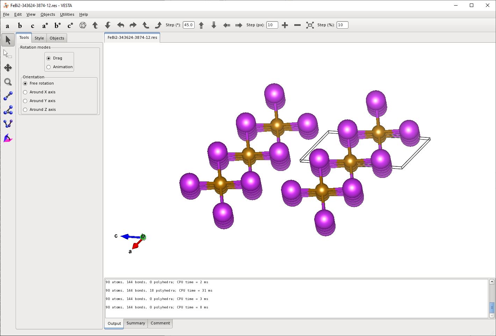

This tutorial will walk through the steps required to set up a search for high-pressure compounds in a binary system. We will use the Fe–Bi system, but the approach can be readily adapted to most systems.

First, use the `gencell` tool to create starting `.cell` and `.param` files to be used with AIRSS. The following command specifies a cell of volume 10 ų containing one iron atom and one bismuth atom.

```console
$ gencell 10 1 Fe 1 Bi 1

Pseudopotential not found - using OTFG, set cut_off_energy manually
Pseudopotential not found - using OTFG, set cut_off_energy manually
```
First let's take a look at the `FeBi.cell` file created:

```
%BLOCK LATTICE_CART
2.154433 0 0
0 2.154433 0
0 0 2.154433
%ENDBLOCK LATTICE_CART
 
#VARVOL=10
 
%BLOCK POSITIONS_FRAC
Fe 0.0 0.0 0.0 # Fe1 % NUM=1
Bi 0.0 0.0 0.0 # Bi1 % NUM=1
%ENDBLOCK POSITIONS_FRAC
 
##SPECIES=Fe,Bi
##NATOM=3-9
##FOCUS=2
 
#SYMMOPS=2-4
##SGRANK=20
#NFORM=1
##ADJGEN=0-1
##SLACK=0.25
##OVERLAP=0.1
#MINSEP=1-3 AUTO
#COMPACT
##SYSTEM={Rhom,Tric,Mono,Cubi,Hexa,Orth,Tetra}
 
KPOINTS_MP_SPACING 0.07
 
SYMMETRY_GENERATE
SNAP_TO_SYMMETRY
 
%BLOCK SPECIES_POT
%ENDBLOCK SPECIES_POT
 
%BLOCK EXTERNAL_PRESSURE
0 0 0
0 0
0
%ENDBLOCK EXTERNAL_PRESSURE
```

By default, we are asking AIRSS to search at the fixed stoichiometry requested in the `gencell` command. We have two atoms in a unit cell of 10 ų, and each search will randomise the position of the atoms as well as the shape of the unit cell. The first thing we will do is enable a search over a broader range of stoichiometries. Start by deleting the following block:

````
%BLOCK POSITIONS_FRAC
Fe 0.0 0.0 0.0 # Fe1 % NUM=1
Bi 0.0 0.0 0.0 # Bi1 % NUM=1
%ENDBLOCK POSITIONS_FRAC
````

And then uncomment the following three lines (note: a comment is `##` and will be ignored by both AIRSS and Castep, a single `#` is read as an instruction by AIRSS, but ignored as a comment by Castep)

```
##SPECIES=Fe,Bi
##NATOM=3-9
##FOCUS=2
```

We do not need to change the species line, but we can reduce the upper number of `#NATOM` to search over simpler stoichiometries. We will leave `#FOCUS=2` because we are looking for binary compounds with at least one of each element.

```
#SPECIES=Fe,Bi
#NATOM=3-6
#FOCUS=2
```

The next block of commands can also be tweaked:

````
#SYMMOPS=2-4
##SGRANK=20
#NFORM=1
##ADJGEN=0-1
##SLACK=0.25
##OVERLAP=0.1
#MINSEP=1-3 AUTO
#COMPACT
##SYSTEM={Rhom,Tric,Mono,Cubi,Hexa,Orth,Tetra}
````

Uncomment the `#ADGEN`, `#SLACK`, and `#OVERLAP` commands (see the Buildcell Manual for details of these commands).

Next, set the pseudopotentials to use `QC5`:

```
%BLOCK SPECIES_POT
QC5
%ENDBLOCK SPECIES_POT
```

In `FeBi2.param`, set the cutoff energy to 480 eV.

```console
cut_off_energy       : 480 eV
```

Run `airss.pl`, requesting an external pressure of 35 GPa. An example batch job request might be:

```console
#!/bin/bash

#BSUB -W 96:0
#BSUB -R rusage[mem=8192]
#BSUB -n 16
#BSUB -J "FeBi2[1-8]"
#BSUB -o logs/out.%J.%I
#BSUB -e logs/err.%J.%I

airss.pl -keep -max 500 -press 35 -seed FeBi2
```

Take a look at the results:

```console
$ ca -u 0.05 -r

FeBi2-343624-3874-12    35.04    53.848   -5103.102   1 Bi2Fe        I4/mmm     3
FeBi2-65003-3378-9      35.00    55.250       0.372   1 Bi2Fe        Cmmm       1
FeBi2-65003-3378-1      35.04    55.402       0.507   1 Bi2Fe        P-3m1      1
FeBi2-17892-7013-1      34.98    55.487       0.567   1 Bi2Fe        R3m        1
FeBi2-65003-3378-4      35.00    56.679       0.778   1 Bi2Fe        R-3m       1
FeBi2-65003-3378-11     34.99    56.670       0.779   1 Bi2Fe        Immm       2
FeBi2-343624-3874-6     35.04    56.688       0.779   1 Bi2Fe        R-3m       4
FeBi2-38675-679-7       35.06    56.700       0.780   1 Bi2Fe        Fm-3m      1
FeBi2-17892-7013-2      34.97    57.134       0.952   1 Bi2Fe        P4/mmm     1
FeBi2-65003-3378-10     35.00    55.436       1.551   1 Bi2Fe        P-6m2      2
FeBi2-343624-3874-14    35.01    58.184       1.630   1 Bi2Fe        Pmmm       1
FeBi2-343624-3874-5     35.01    57.257       1.681   1 Bi2Fe        P4/mmm     1
FeBi2-65003-3378-3      35.03    57.539       2.089   1 Bi2Fe        P3m1       3
FeBi2-343624-3874-1     35.02    58.500       3.086   1 Bi2Fe        P6/mmm     1
FeBi2-65003-3378-2      34.94    65.838       3.793   1 Bi2Fe        P-6m2      1
```

The top hit is the `I4/mmm` structure that is very close to the `I4/mcm` structure discovered experimentally above 30 GPa.


